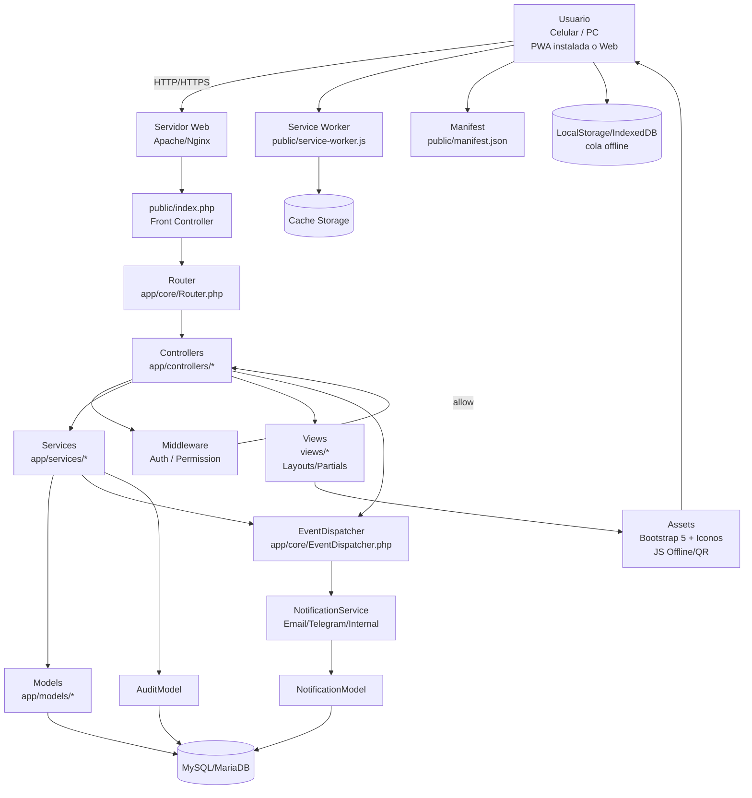
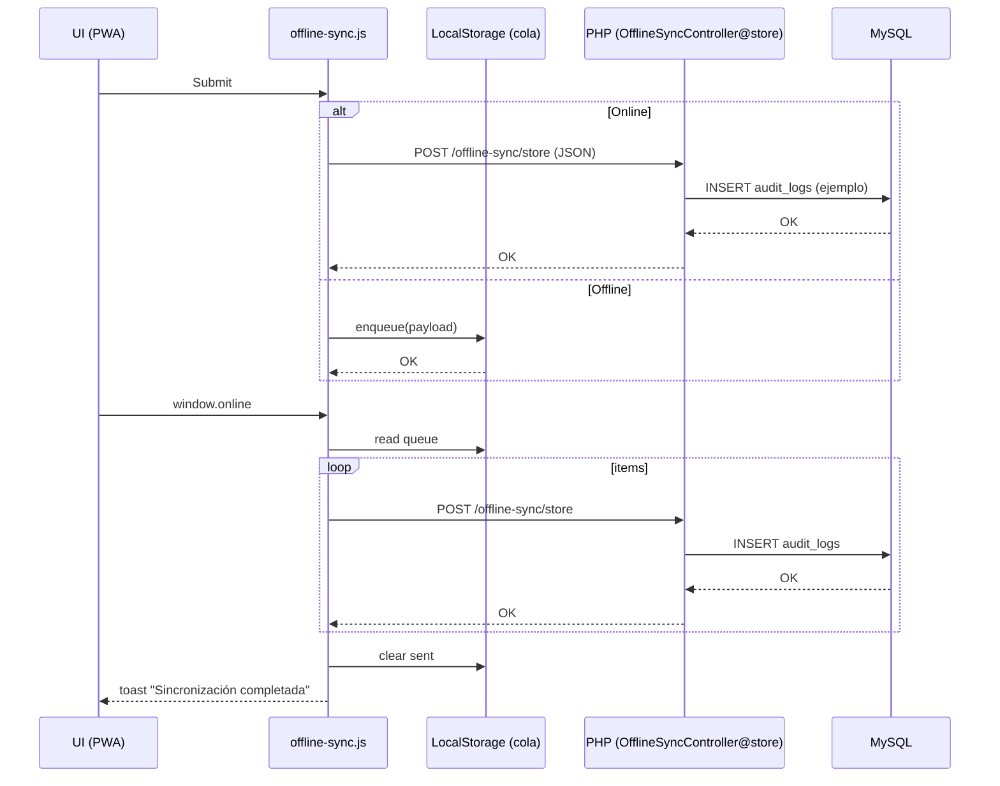
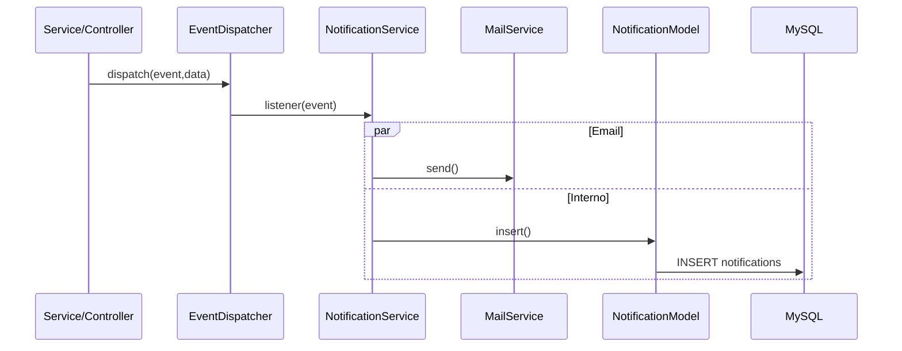

# Starter Kit RKM v6 - Arquitectura

## Diagrama 1: Arquitectura por capas

```mermaid
flowchart TB
  U[Usuario<br/>Celular / PC<br/>PWA instalada o Web] -->|HTTP/HTTPS| W[Servidor Web<br/>Apache/Nginx]
  W --> FC[public/index.php<br/>Front Controller]

  FC --> RT[Router<br/>app/core/Router.php]
  RT --> CT[Controllers<br/>app/controllers/*]

  CT --> MW[Middleware<br/>Auth / Permission]
  MW -->|allow| CT

  CT --> SV[Services<br/>app/services/*]
  SV --> MD[Models<br/>app/models/*]
  MD --> DB[(MySQL/MariaDB)]

  CT --> VW[Views<br/>views/*<br/>Layouts/Partials]

  CT --> EV[EventDispatcher<br/>app/core/EventDispatcher.php]
  SV --> EV
  EV --> NT[NotificationService<br/>Email/Telegram/Internal]
  NT --> NM[NotificationModel]
  NM --> DB

  SV --> AU[AuditModel]
  AU --> DB

  VW --> AS[Assets<br/>Bootstrap 5 + Iconos<br/>JS Offline/QR]
  AS --> U

  U --> SW[Service Worker<br/>public/service-worker.js]
  U --> MF[Manifest<br/>public/manifest.json]
  SW --> CA[(Cache Storage)]
  U --> IDB[(LocalStorage/IndexedDB<br/>cola offline)]
```

## Diagrama 2: Offline Sync

```mermaid
sequenceDiagram
  participant UI as UI (PWA)
  participant JS as offline-sync.js
  participant LS as LocalStorage (cola)
  participant API as PHP (OfflineSyncController@store)
  participant DB as MySQL
  UI->>JS: Submit
  alt Online
    JS->>API: POST /offline-sync/store (JSON)
    API->>DB: INSERT audit_logs (ejemplo)
    DB-->>API: OK
    API-->>JS: OK
  else Offline
    JS->>LS: enqueue(payload)
    LS-->>JS: OK
  end
  UI->>JS: window.online
  JS->>LS: read queue
  loop items
    JS->>API: POST /offline-sync/store
    API->>DB: INSERT audit_logs
    DB-->>API: OK
    API-->>JS: OK
  end
  JS->>LS: clear sent
  JS-->>UI: toast "Sincronización completada"
```

## Diagrama 3: Eventos + Notificaciones

```mermaid
sequenceDiagram
  participant SV as Service/Controller
  participant EV as EventDispatcher
  participant NS as NotificationService
  participant MS as MailService
  participant NM as NotificationModel
  participant DB as MySQL
  SV->>EV: dispatch(event,data)
  EV->>NS: listener(event)
  par Email
    NS->>MS: send()
  and Interno
    NS->>NM: insert()
    NM->>DB: INSERT notifications
  end
```
